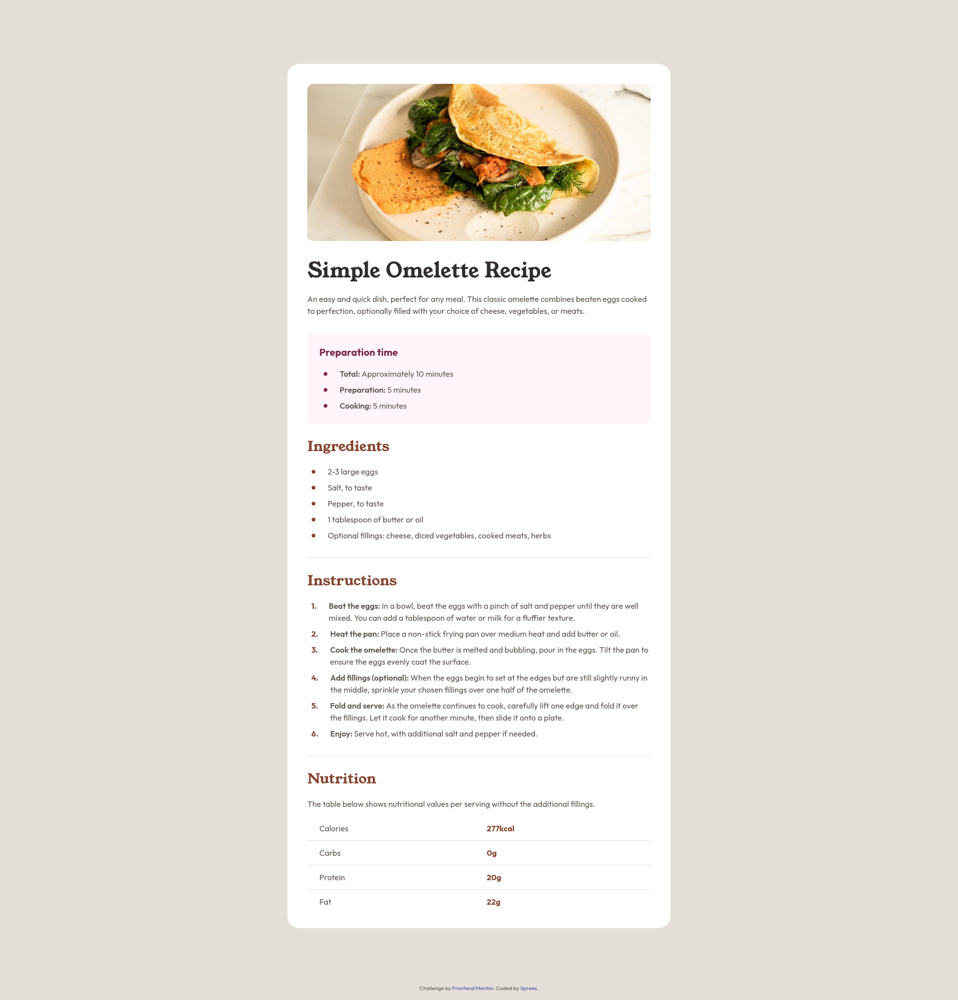

# Frontend Mentor - Recipe page solution

This is a solution to the [Recipe page challenge on Frontend Mentor](https://www.frontendmentor.io/challenges/recipe-page-KiTsR8QQKm). Frontend Mentor challenges help you improve your coding skills by building realistic projects. 

## Table of contents

- [Overview](#overview)
  - [Screenshot](#screenshot)
  - [Links](#links)
- [My process](#my-process)
  - [Built with](#built-with)
  - [What I learned](#what-i-learned)
  - [Continued development](#continued-development)
  - [Useful resources](#useful-resources)
- [Author](#author)
- [Acknowledgments](#acknowledgments)

## Overview

### Screenshot

### Links

- Solution URL: [Github Repo](https://github.com/Sprees/fe-mentor_recipe-page)
- Live Site URL: [Github Pages](https://sprees.github.io/fe-mentor_recipe-page/)

## My process

### Built with

- Semantic HTML5 markup
- CSS custom properties
- Flexbox
- CSS Grid
- Mobile-first workflow

### What I learned

I learned `ul` and `ol` tags get their bullets/counters from the browser which makes styling them very limited. I had trouble getting my `ol` bullet vertically centering with longer blocks of text. I ended up having to remove the bullets completely and adding my own custom bullets to manipulate them the way I wanted to. Also for `ol`, I could not figure out how to set a different font family on the provided numbers, so I did the same, removed the list style, and added my own custom counters, where I was able to explore the `counter-reset`, `counter-increment` and `counter()` css properties.

### Continued development

I am focused on creating maintainable and scalable CSS using the default technologies.

## Author

- Website - [Sprees | Github](https://github.com/Sprees)
- Frontend Mentor - [@Sprees](https://www.frontendmentor.io/profile/Sprees)
